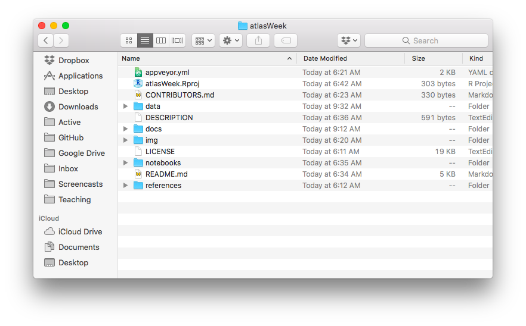
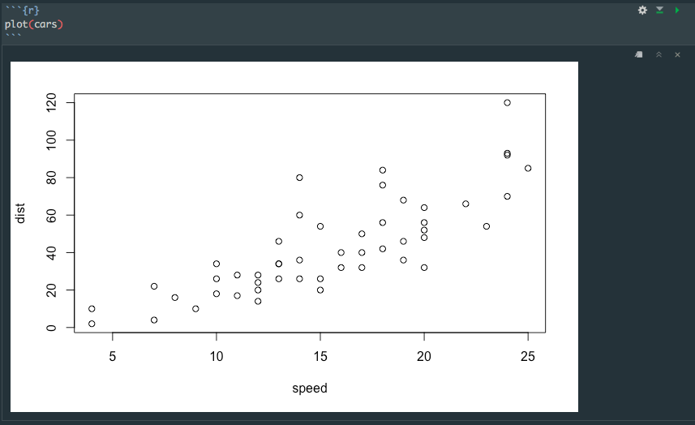
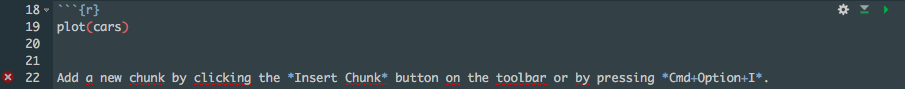
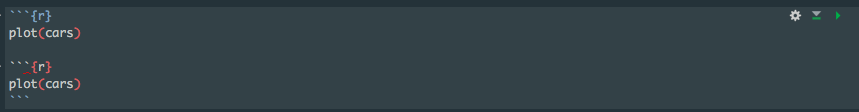

class: inverse, center, middle

```{r setup, include=FALSE}
options(htmltools.dir.version = FALSE)
```

# Overview

---
# What is the SLU DSS?

The [SLU Data Science Seminar](https://slu-dss.githb.io) (DSS) is a collaborative, interdisciplinary group at Saint Louis University focused on building researchers’ data science skills using open source software. We currently host seminars focused on the programming language `R`.

We host:

1. Four-part seminars each semester on specific topics related to `R`
2. Brownbags by guest facilitators showcasing how they use `R` for research or teaching
3. An ATLAS Week Session introducing participants to `R`

---
# Basics

- **`R`** is a programming language first developed in 1993 for statistical computing
    - The `R` ecosystem has rapidly expanded in the last ten years to include tools for project management, graphics production, machine learning, GIS, and dissemination (these slides are made with `R`!)
- People are attracted to `R` because it is:
    - *free*
    - *highly extensible* - there are over 12,000 packages available on **CRAN** 

--
- ...but `R` has a bit of a reputation...
    
--

- RStudio is a **G**raphical **U**ser **I**nterface (**GUI**) for `R` that makes working with the programming language *much* easier

--

- One of the reasons interest in `R` has grown rapidly is the **`tidyverse`**, which is a family of packages that use an easy to read and implement syntax for conducting common data management tasks

---
# Installing Packages

One of the first tasks we face with `R` is getting packages installed. The `base` distribution of `R` comes with some packages, but we'll need a few more for today. Each package contains a set of *functions* (easy to execute, generalized blocks of code) that we can use in our own projects.

The `install.packages()` function from `utils` is the easiest way to install a package:

```{r install-packages, eval=FALSE}
install.packages("usethis")
```

--

We only need to install packages once per user, but we may need to update them periodically:

```{r update-packages, eval=FALSE}
update.packages()
```

---
# Installing Packages
### Your Turn
Practice installing a package called `here`.

--
### Solution

```{r install-packages-practice, eval=FALSE}
install.packages("here")
```

---
# Loading Packages

While we only have to install packages once per user, we must load them at the beginning of **each** session using the `library()` function:

```{r load-packages}
library(usethis)
```

---
# Loading Packages
### Your Turn
Practice loading the package you just installed called `here`.

--

### Solution

```{r load-packages-practice}
library("here")
```

---
# Using Functions

The easiest way to use functions is to enter them into the **console** and hit **enter** or **return** when you are ready to execute the function.

Functions contain one or more *arguments* that we provide inputs for, and then function's code uses those arguments to (hopefully!) produce a desired output.

For example, the `use_course()` function from `usethis` takes one required argument - the **url** of the GitHub repository that contains course materials to download:

```{r download-course, eval=FALSE}
use_course(url = "https://goo.gl/cQxw6n")
```

When you execute it, you'll be asked for further inputs in your **console** - you should proceeded with the download and then delete the ZIP file.

---
# R Projects
When you download the ATLAS week course from GitHub, you'll see a file named `atlasWeek.Rproj` in the top-level of the directory:




---
# R Projects
`atlasWeek.Rproj` is a file created by RStudio that helps us manage our **working directory**, the location on our computer that `R` assumes we want to open files from and save files to.

Working directories are a **huge** struggle for new programmers, because they require an awareness of our file system that end users are not routinely required to have.

We can use `.Rproj` files to open RStudio and automatically set the working directory to the folder the `.Rproj` file is in. New R projects can be created by going to `File > New Project...` in RStudio.

---
# R Projects
Once we have a `R` project open, we can use **relative paths** to open and save files as long as our data, code, and output will be stored **inside** our project folder. This is a best practice for **reproducible research** because your project can be moved between computers and will still execute even though the location of the files has changed.

We'll use the `here` package to specify file paths. This gives us the flexibility to use subfolders like `data/` and `notebooks/`:

```{r here-example}
here("data", "stlMurders.csv")
```

We enclose each folder and file with double quotes, and separate them with commas.

---
# Projects Organization
We recommend using a standard set of sub-folders for each project to keep things organized:


---
# More Set-up
There are a few other packages that we'll need for today. You can find them listed in `references/SETUP.md` - open that file using RStudio's file explorer and use `install.packages()` to install them. 

For the `tidyverse` packages, you can use this syntax instead of installing them individually:

```{r install-tidyverse, eval=FALSE}
install.packages("tidyverse")
```

---
# R Notebooks
Our DSS seminars teach using `R` Notebooks, which are special types of files that allow us to "weave" narrative text about our work with `R` code. These are enabled by using two primary packages - `knitr` and `RMarkdown`.

You can open our first notebook by going to the `notebooks/` sub-folder in RStudio's file explorer and opening `atlas-01-dataCleaning.Rmd`.

Our `R` notebooks are set-up to create an `.html` output that you can preview in a web browser, and a `.md` Markdown file that renders nicely on GitHub. 

If you use the `.html` notebooks, you can email them to colleagues - they will include all of your narrative text, your code, and the associated output.

---
# R Notebooks
Use the green "play button" on the right side of code chunks to execute them:



---
# R Notebooks
Be **very** careful with the triple backticks at the beginning and end of the code chunk! Both of the following images have modified the code chunk to remove back-ticks.

In the first example, the three backticks at the end of the chunk have been removed so that all of the proceeding narrative text is treated as if it is code itself:



In this example, two code chunks have been inadvertently been paired together:



---
# Markdown
All of the writing in this document uses [R Markdown](http://rmarkdown.rstudio.com) syntax. We use Markdown because it is simple to learn and allows us to work in plain text files so we aren't dependent on proprietary (and expensive!) software. RStudio can render Markdown into various formats like `html` and `pdf`.

---
# Markdown
We use the number sign for headings where one number sign is the highest level heading and six number signs are the lowest level headings. 

### Input:
```markdown
# Top-level Heading
## Second-level Heading
```

### Output:
# Top-level Heading
## Second-level Heading

---
# Markdown
We use asterisk symbols and back-ticks for including rich text.

### Input
```
*This is italicized text*, **this is bold text**, and `this is text 
in a typewriter font`. We use the `typewriter font` to refer to 
file and variable names.
```

### Output
*This is italicized text*, **this is bold text**, and `this is text in a typewriter font`. We use the `typewriter font` to refer to file and variable names.

---
# Getting Help
There are lots of resources online for getting help, and we've linkd to some of them in the `README.md` file included with this project.

You can also get help from within RStudio by using the `?` syntax. The following syntax will give us the package-level help file for `usethis`:

```{r, eval=FALSE}
?usethis
```

And this will give us the specific help file for `use_course()`:

```{r, eval=FALSE}
?use_course
```