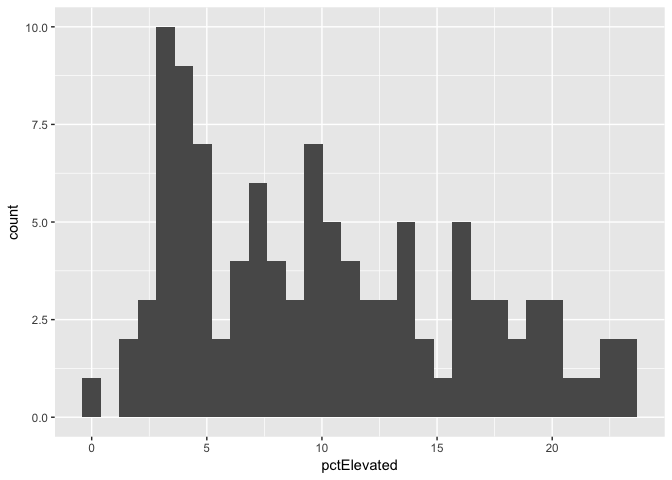
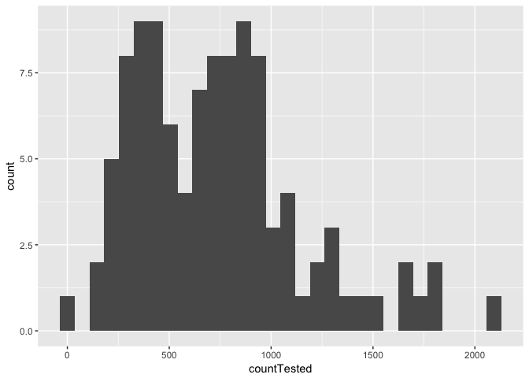
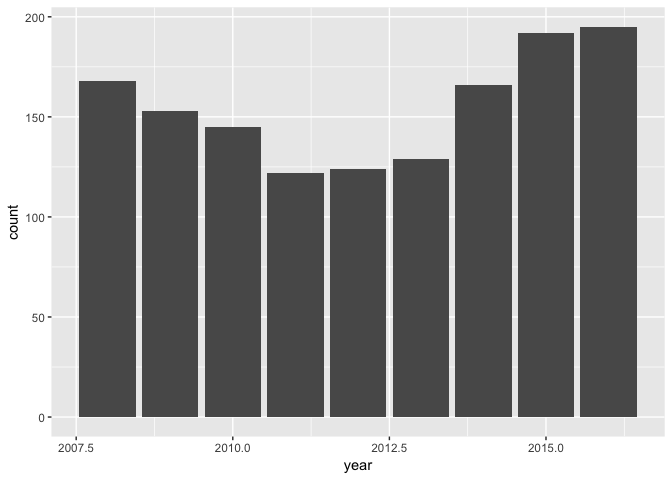
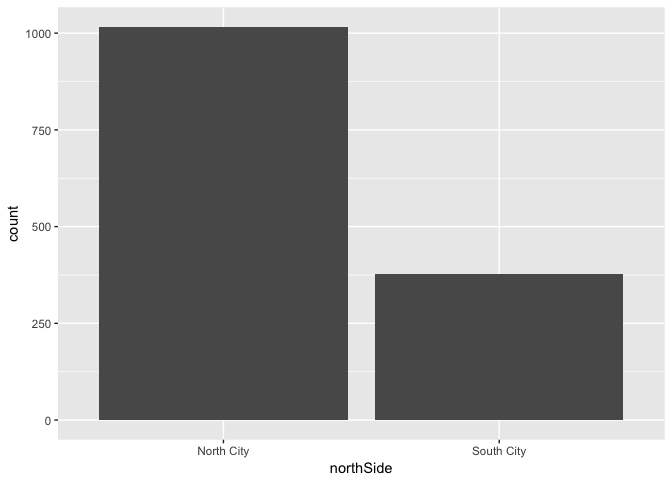
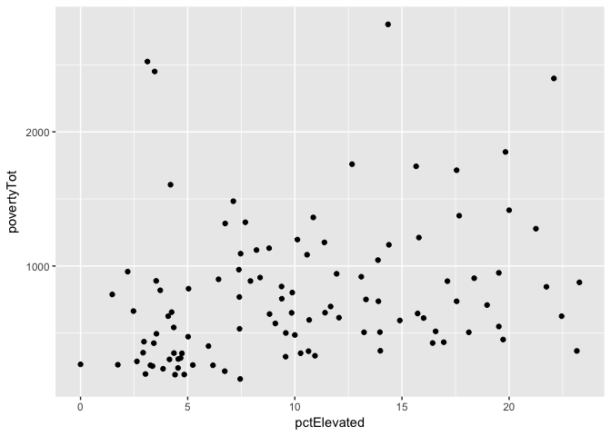
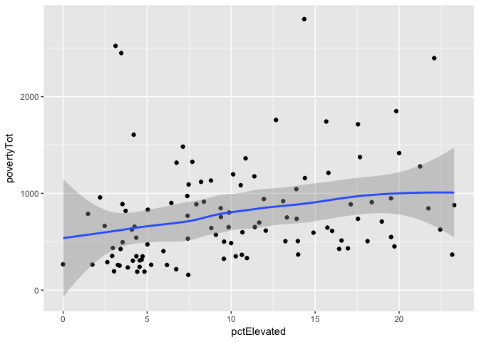
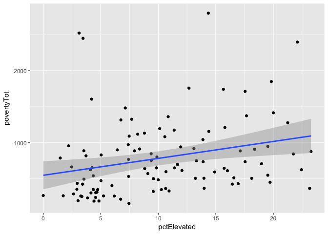
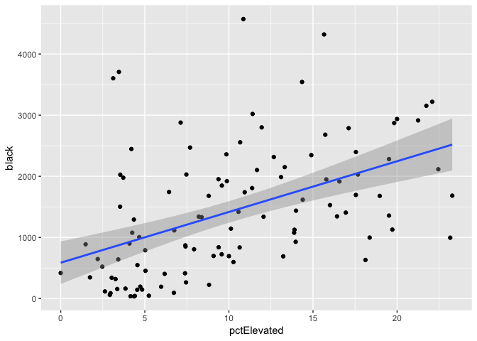

Accessible Data Analysis: Data Plotting
================
Christy Garcia and Chris Prener
(April 11, 2018)

Introduction
------------

This is the third of three notebooks for our ATLAS week session.

Dependencies
------------

The following packages are required for this notebook:

``` r
# tidyverse packages
library(dplyr)  # data wrangling
```

    ## 
    ## Attaching package: 'dplyr'

    ## The following objects are masked from 'package:stats':
    ## 
    ##     filter, lag

    ## The following objects are masked from 'package:base':
    ## 
    ##     intersect, setdiff, setequal, union

``` r
library(ggplot2) # data plotting
```

    ## 
    ## Attaching package: 'ggplot2'

    ## The following object is masked from 'package:dplyr':
    ## 
    ##     vars

``` r
library(readr)  # data import

# other packages
library(here)    # file paths
```

    ## here() starts at /Users/chris/GitHub/DSS/atlasWeek

``` r
library(janitor) # frequency tables
```

    ## Warning: package 'janitor' was built under R version 3.4.4

``` r
library(skimr)   # descriptive statistics
```

    ## 
    ## Attaching package: 'skimr'

    ## The following objects are masked from 'package:dplyr':
    ## 
    ##     contains, ends_with, everything, matches, num_range, one_of,
    ##     starts_with

Loading Data
------------

We need the same two data tables we used in the first notebook for this notebook as well:

``` r
lead <- read_csv(here("data", "stlLead.csv"))
```

    ## Parsed with column specification:
    ## cols(
    ##   geoID = col_double(),
    ##   tractCE = col_double(),
    ##   nameLSAD = col_character(),
    ##   countTested = col_double(),
    ##   pctElevated = col_double(),
    ##   totalPop = col_double(),
    ##   totalPop_MOE = col_double(),
    ##   white = col_double(),
    ##   white_MOE = col_double(),
    ##   black = col_double(),
    ##   black_MOE = col_double(),
    ##   povertyTot = col_double(),
    ##   povertyTot_MOE = col_double(),
    ##   povertyU18 = col_double(),
    ##   povertyU18_MOE = col_double()
    ## )

``` r
murders <- read_csv(here("data", "stlMurders.csv"))
```

    ## Parsed with column specification:
    ## cols(
    ##   id = col_double(),
    ##   fullDate = col_character(),
    ##   year = col_double(),
    ##   month = col_double(),
    ##   day = col_double(),
    ##   time = col_double(),
    ##   descrip = col_character(),
    ##   district = col_double(),
    ##   nhood = col_double(),
    ##   address = col_double(),
    ##   street = col_character()
    ## )

Basic plots
-----------

R offers many ways of making sophisticated plots, including the package `ggplot2`. We will use this package to makes some plots without worrying too much about the syntax of the commands. For more information on `ggplot2`, see Wickham (2015).

### Histograms

The basic `ggplot2` call requires the assignment of a data frame and an aesthetic variable in the first line to an object named `leadPlot01`. The second line calls the specific type of plot we want to make as a "geom". In this case, we'll use the `geom_histogram()`. Note that we call the object `leadPlot01` afterwards to display it.

``` r
leadPlot01 <- ggplot(lead, aes(x=pctElevated)) +
  geom_histogram()
leadPlot01
```

    ## `stat_bin()` using `bins = 30`. Pick better value with `binwidth`.



Now try making a histogram for the `countTested` variable in the `lead` data frame.

``` r
leadPlot02 <- ggplot(lead, aes(x = countTested)) +
  geom_histogram()
leadPlot02
```

    ## `stat_bin()` using `bins = 30`. Pick better value with `binwidth`.



### Bar Charts

In this example, we assign our plot of the `murder` data frame's `year` variable to the `murderPlot01` object. We use the `geom_bar()` function to create a bar plot of these data, which indicate the number of murders by year. As in the previous example, we call the object `murderPlot01` afterwards to display it.

``` r
murderPlot01 <- ggplot(murders, aes(x = year)) +
  geom_bar()
murderPlot01
```



Before we move on, we'll re-create the `northSide` variable we've been working with today:

``` r
murders <- mutate(murders, northSide = ifelse(nhood > 45, "North City", "South City"))
```

Now try making a bar plot for the `northSide` variable in the `murders` data frame.

``` r
murderPlot02 <- ggplot(murders, aes(x = northSide)) +
  geom_bar()
murderPlot02
```



#### Scatter plots

For our scatter plot example, we assign our plot of the `lead` data frame's `pctElevated` and `povertyTot` variables to the `leadPoverty` object. We use the `geom_point` function to create a scatter plot of these data, which indicate the percent of elevated lead levels by the number of people living in poverty. Before, we just had one variable name in aes() since we were only plotting one variable. Now, we specify the two variables we would like to plot in the scatter plot, separated by a comma, with the variable on the x-axis listed first.

``` r
leadPlot03 <- ggplot(lead, aes(x = pctElevated, y = povertyTot)) + 
  geom_point()
leadPlot03 
```



We can also add a smooth curve or linear regression line (with confidence intervals) to our plot by adding the `geom_smooth` function to our code.

``` r
leadPlot04 <- ggplot(lead, aes(x = pctElevated, y = povertyTot)) + 
  geom_point() + 
  geom_smooth()
leadPlot04
```

    ## `geom_smooth()` using method = 'loess' and formula 'y ~ x'



If we want a linear plot line, we can add the `"lm"` argument to `geom_smooth`:

``` r
leadPlot04 <- ggplot(lead, aes(x = pctElevated, y = povertyTot)) + 
  geom_point() + 
  geom_smooth(method="lm")
leadPlot04
```



Now try making a scatter plot with a fitted line (either type) for the `pctElevated` and `black` variables in the `lead` data frame.

``` r
leadPlot05 <- ggplot(lead, aes(x = pctElevated, y = black)) + 
  geom_point() + 
  geom_smooth(method="lm")
leadPlot05
```



#### Saving plots

To save the plots we have made, we can use the function `ggsave`, which will save the plot to our working directory. First specify the object name ('leadU18') and then after 'file' specify the file name and type.

``` r
ggsave(leadPlot04, file = here("results", "leadPovertyScatter.png"))
```

    ## Saving 7 x 5 in image
