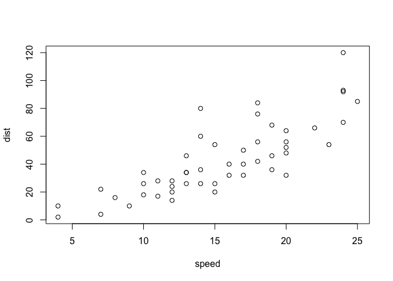

Accessible Data Analysis: Data Cleaning (Completed)
================
Christy Garcia and Chris Prener
(April 11, 2018)

Introduction
------------

This is the first of three notebooks for our ATLAS week session.

Dependencies
------------

The following packages are required for this notebook:

``` r
# tidyverse packages
library(dplyr)  # data wrangling
```

    ## 
    ## Attaching package: 'dplyr'

    ## The following objects are masked from 'package:stats':
    ## 
    ##     filter, lag

    ## The following objects are masked from 'package:base':
    ## 
    ##     intersect, setdiff, setequal, union

``` r
library(readr)  # data import

# other packages
library(here)   # file paths
```

    ## here() starts at /Users/chris/GitHub/DSS/atlasWeek

R Notebooks
-----------

This is an [R Markdown](http://rmarkdown.rstudio.com) Notebook. When you execute code within the notebook, the results appear beneath the code.

Try executing this chunk by clicking the *Run* button within the chunk or by placing your cursor inside it and pressing *Cmd+Shift+Enter*.

``` r
plot(cars)
```



Add a new chunk by clicking the *Insert Chunk* button on the toolbar or by pressing *Cmd+Option+I*.

When you save the notebook, an `html` file containing the code and output will be saved alongside it (click the *Preview* button or press *Cmd+Shift+K* to preview the `html` file). The `html` file will always be saved in the directory that your R Markdown file is saved in.

If you want to create a new R Notebook, you can do that by going to `File > New File > R Notebook`.

Loading Data
------------

First, we'll want to load both of our data sets into R's memory. We'll use the `readr` package combined with the `here` package to read in data that is stored in the `data/` sub-folder of our project. The `read_csv()` function can be used to easily read in `.csv` data.

We need to not only read the data in but also assign it to a new object. For instance, we can take the data from the data `stlMurders.csv` and assign it to an object named `murders` by using the assignment operator (`<-`):

``` r
murders <- read_csv(here("data", "stlMurders.csv"))
```

    ## Parsed with column specification:
    ## cols(
    ##   id = col_double(),
    ##   fullDate = col_character(),
    ##   year = col_double(),
    ##   month = col_double(),
    ##   day = col_double(),
    ##   time = col_double(),
    ##   descrip = col_character(),
    ##   district = col_double(),
    ##   nhood = col_double(),
    ##   address = col_double(),
    ##   street = col_character()
    ## )

Now you try to use the same syntax to load the `stlLead.csv` data:

``` r
lead <- read_csv(here("data", "stlLead.csv"))
```

    ## Parsed with column specification:
    ## cols(
    ##   geoID = col_double(),
    ##   tractCE = col_double(),
    ##   nameLSAD = col_character(),
    ##   countTested = col_double(),
    ##   pctElevated = col_double(),
    ##   totalPop = col_double(),
    ##   totalPop_MOE = col_double(),
    ##   white = col_double(),
    ##   white_MOE = col_double(),
    ##   black = col_double(),
    ##   black_MOE = col_double(),
    ##   povertyTot = col_double(),
    ##   povertyTot_MOE = col_double(),
    ##   povertyU18 = col_double(),
    ##   povertyU18_MOE = col_double()
    ## )

Data Cleaning
-------------

Our data often do not come to us in the best shape - the variables we need may need some editing or may not be present at all. The "tidyverse" has some excellent tools for exploring and modifying our data.

### Exploring Values

There are a number of ways that we can explore our data. We can use the `View()` function to open up a spreadsheet-like view of our data:

``` r
View(murders)
```

Try this for the `lead` data:

``` r
View(lead)
```

We can also use the `glimpse()` function from `dplyr` to get a list of all variables present in our data frame:

``` r
glimpse(murders)
```

    ## Observations: 1,394
    ## Variables: 11
    ## $ id       <dbl> 1988, 2712, 3276, 3400, 4689, 4722, 5567, 6258, 6295,...
    ## $ fullDate <chr> "12jan2008", "17jan2008", "20jan2008", "21jan2008", "...
    ## $ year     <dbl> 2008, 2008, 2008, 2008, 2008, 2008, 2008, 2008, 2008,...
    ## $ month    <dbl> 1, 1, 1, 1, 1, 1, 2, 2, 2, 2, 2, 2, 2, 2, 2, 2, 2, 2,...
    ## $ day      <dbl> 12, 17, 20, 21, 30, 30, 4, 9, 9, 11, 12, 16, 21, 22, ...
    ## $ time     <dbl> 1237, 400, 2119, 1738, 1534, 1919, 1745, 1730, 2259, ...
    ## $ descrip  <chr> "HOMICIDE", "HOMICIDE", "HOMICIDE", "HOMICIDE", "HOMI...
    ## $ district <dbl> 7, 7, 7, 1, 8, 8, 9, 7, 6, 4, 4, 8, 7, 6, 6, 1, 7, 6,...
    ## $ nhood    <dbl> 50, 48, 50, 16, 0, 55, 29, 48, 71, 61, 36, 55, 50, 68...
    ## $ address  <dbl> 5738, 5356, 5826, 3859, 4100, 2418, 1646, 5617, 5001,...
    ## $ street   <chr> "TERRY AVE", "PAGE BLVD", "ROOSEVELT PL", "OHIO AVE",...

Try this for the `lead` data:

``` r
glimpse(lead)
```

    ## Observations: 106
    ## Variables: 15
    ## $ geoID          <dbl> 29510118100, 29510117400, 29510126700, 29510119...
    ## $ tractCE        <dbl> 118100, 117400, 126700, 119102, 126800, 126900,...
    ## $ nameLSAD       <chr> "Census Tract 1181", "Census Tract 1174", "Cens...
    ## $ countTested    <dbl> 345, 871, 458, 182, 486, 1296, 903, 585, 2116, ...
    ## $ pctElevated    <dbl> 9.57, 12.06, 18.12, 2.20, 4.73, 15.66, 11.41, 1...
    ## $ totalPop       <dbl> 1161, 4307, 1089, 3237, 3490, 4590, 3144, 2052,...
    ## $ totalPop_MOE   <dbl> 192, 447, 199, 309, 231, 826, 464, 273, 516, 27...
    ## $ white          <dbl> 414, 2604, 432, 2008, 3026, 148, 108, 304, 1777...
    ## $ white_MOE      <dbl> 100, 303, 116, 262, 270, 217, 111, 82, 391, 212...
    ## $ black          <dbl> 724, 1338, 631, 646, 194, 4320, 3020, 1739, 360...
    ## $ black_MOE      <dbl> 179, 374, 187, 210, 98, 760, 442, 283, 621, 190...
    ## $ povertyTot     <dbl> 324, 615, 506, 958, 349, 1743, 652, 331, 2524, ...
    ## $ povertyTot_MOE <dbl> 140, 255, 164, 234, 129, 825, 305, 156, 598, 88...
    ## $ povertyU18     <dbl> 109, 169, 98, 15, 35, 627, 256, 47, 1110, 15, 2...
    ## $ povertyU18_MOE <dbl> 105, 156, 60, 25, 47, 595, 136, 79, 318, 23, 30...

### Renaming Variables

We can rename variables easily using the `dplyr` package's `rename()` function. We need three pieces of information within the `rename()` function - the data frame, the new variable name, and the old variable name (separated by a single equals sign):

``` r
murders <- rename(murders, date = fullDate)
```

This gives us a simpler variable name to work with in the future - less typing is always a plus! Every time we make a change, we need to assign that change to either an existing or a new object.

Now try renaming the `nhood` variable to `neighborhood`:

``` r
murders <- rename(murders, neighborhood = nhood)
```

### Removing Variables

We can also get rid of variables easily using the `dplyr` package's `select()` function. For instance, we could remove some of the date data for each of the murders in our data frame using a negative sign in front of each variable we want to remove:

``` r
murders <- select(murders, -month, -day)
```

Now, try removing the variables `geoID`, `totalPop_MOE`, `white_MOE`, `black_MOE`, `povertyTot_MOE`, and `povertyU18_MOE` from the `lead` object:

``` r
lead <- select(lead, -geoID, -totalPop_MOE, -white_MOE, -black_MOE, -povertyTot_MOE, -povertyU18_MOE)
```

### Creating New Variables

Finally, we can create new variables using the `dplyr` package's `mutate()` function. For instance, we can create an indicator for neighborhoods that are on the north side of St. Louis in the murder data frame.

We'll use the `ifelse()` function to help with this process. If our test (a neighborhood number greater than 45) is evaluated as 'TRUE', the new variable will contain "North City". Otherwise, it will contain "South City":

``` r
murders <- mutate(murders, northSide = ifelse(neighborhood > 45, "North City", "South City"))
```

This creates a **character** variable with text data in it. R is generally more accommodating to using string/character data in plots and analyses than other statistical packages are.

We can make our tests more complicated by using logical operators like `&` (and) or `|` (or):

``` r
murders <- mutate(murders, greaterVille = ifelse(neighborhood >= 50 & neighborhood <= 59, TRUE, FALSE))
```

This creates a **logical** variable, which *must* contain either `TRUE` or `FALSE` values. These are treated in the same way that many statistics packages treat variables coded as `0` or `1`.

This logical variable is `TRUE` if the neighborhood is one of these: \* 50 - Wells Goodfellow \* 51 - Academy \* 52 - Kingsway West \* 53 - Fountain Park \* 54 - Lewis Place \* 55 - Kingsway East \* 56 - Greater Ville \* 57 - The Ville \* 58 - Vandeventer \* 59 - Jeff Vanderlou

Finally, we can make new variables based on the outcome of mathematical equations. For instance, the lead data contains a variable named `pctElevated`. We can create a new variable that represents the proportion of elevated tests by multiplying `pctElevated` by 100:

``` r
lead <- mutate(lead, propElevated = pctElevated / 100)
```

We use the standard mathematical operators -, +, /, and \* for these operations.

Now try creating a new variable in the lead data for [Census Tracts](https://www.census.gov/geo/reference/gtc/gtc_ct.html) that calculates the number of positive tests (name this `countElevated`) rather than the proportion by multiplying the number of kids tested (`countTested`) by the proportion of kids with elevated tests (`propElevated`):

``` r
lead <- mutate(lead, posTest = countTested*propElevated)
```

### Reformatting Variables

Sometimes R imports our data but assigns it a different storage type than what we need. For instance, the data in the `year` variable in the murder data frame is really factor data (i.e. a categorical variable) but R is treading it as if it were continuous. We can reformat this using the `as.factor()` function:

``` r
murders <- mutate(murders, year = as.factor(year))
```

R comes with other functions like `as.character()`, `as.numeric`, and `as.integer()` for other types of common modifications.

Now try reformatting the `lead` data's variable `tractCE`, which likewise is imported as continuous variable but really isn't. Convert it to character data:

``` r
lead <- mutate(lead, tractCE = as.character(tractCE))
```
